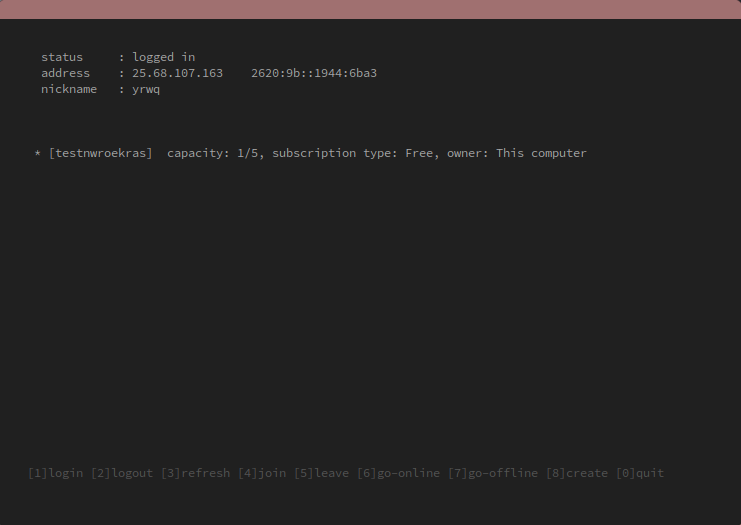

# hatuichi

A simple tui client for `logmein hamachi`

- minimal
- easy to use
- fast

## Dependencies 

- `bash`
- `logmein-hamachi` 

## Usage 

### installation

1. clone the repo

```bash
git clone https://github.com/yrwq/hatuichi
cd hatuichi
```

2. make hatuichi executable

```bash
chmod +x hatuichi
```

3. copy hatuichi to somewhere in your PATH

```bash
cp hatuichi ~/.local/bin/
```

### starting

1. Start logmein-hamachi daemon

```bash
sudo /etc/init.d/logmein-hamachi start
```

2. Run `hatuichi`


### keys

```sh
1: login
2: logout
r: refresh
q: quit
```




## Why?

¯\\\_(ツ)_/¯
